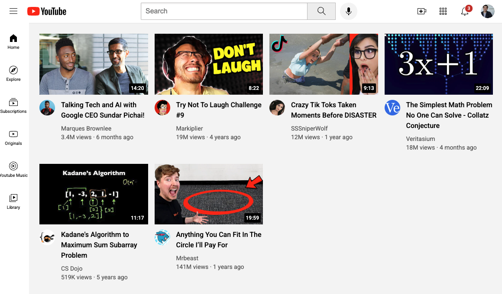

1. Project Title
   - YouTube Clone (HTML & CSS Only)

3. Description
   - This is a simple YouTube homepage clone built using only HTML and CSS. The project was created as part of a tutorial to practice frontend development skills, focusing on layout structure, responsiveness, and styling.

4. Features
     - ✅ Responsive design
     - ✅ Styled with CSS Flexbox & Grid
     - ✅ Basic YouTube UI replication

6. Screenshot

7. How to use
   1. Clone the repository: git clone https://github.com/your-username/youtube-clone.git
   2. Open index.html in a browser.
  
8. Technologies used
   - HTML
   - CSS
  
9. Credits
    - This project was created by following HTML & CSS Full course - Beginner to Pro by SuperSimpleDev on Youtube.
